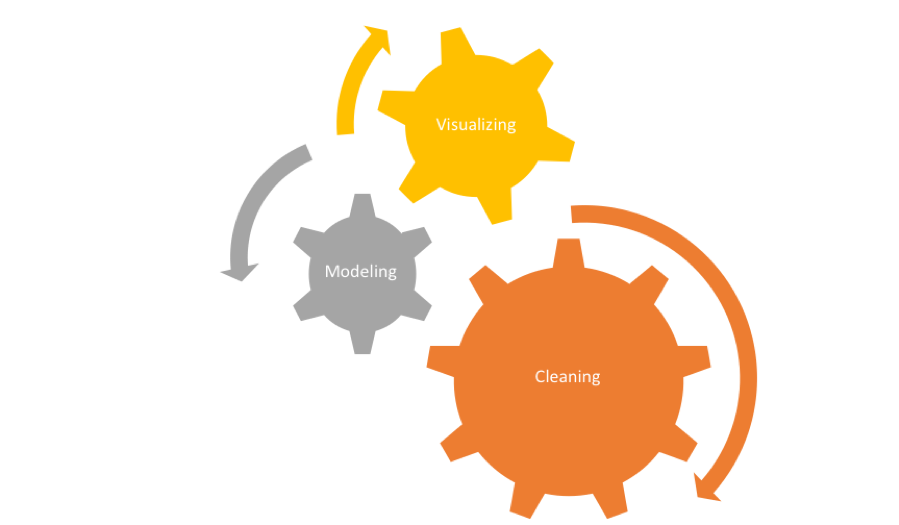

```{r setup, include=FALSE}
options(htmltools.dir.version = FALSE)
```

background-image: url(https://upload.wikimedia.org/wikipedia/commons/b/be/Sharingan_triple.svg)

???

Image credit: [Wikimedia Commons](https://commons.wikimedia.org/wiki/File:Sharingan_triple.svg)

---
class: inverse, center, middle

# Get Started

---

# My Background

- University of Colorado
- US Geological Survey
- UCLA Center for Health Policy Research
- Highmark Inc
- Why I like R
---
class: inverse
# An R Project

- Background
- Data Collection
- The Resuls
- The R application
---
# Today's Agenda

- Course Overview
- Programming, coding and version control - the data science workflow
- Introduction to GitHub, R, RStudio, and R-Markdown
---
class: inverse
# How this class will work

* Basic understanding of programming  
* Some stats knowledge presumed
* Class attendance is mandatory  
* Collaboration is expected  
* Class will be very cumulative  
---

# Grading Structure

Two 80 minute lectures a week:  
First 30 minutes: concepts, methods, examples  
Last 50 minutes: labs  
Class participation (15%)  
Lab Work (15%)
Assignments (20%)  
Final project (50%)  
Disclaimer: Lab work and class participation can be adjusted at instructer's discretion. While late homeworks will not be accepted for grades, I highly encourage you to compelte them and turn them in.   
---
class: inverse
# More about grading

Class participation/Labs (30%)

Labs: Each lecture has an accompanying lab assignment that is due in class.
The completion of labs is required to finish your homework

Homework assignments (20%)

Homework: There will be three homework assignment that builds on top of your in-class labs. Each homework also builds on top of the other homeworks.
Single lowest HW score will be dropped
HW assigned are due following week at start of class
Late homework will not be accepted for credit

Final project (50%)

Final Project: Instead of a final test, we will have a final project that will be in the form of a complete report that will be the accumulation of all the labs and homeworks. I encourage you to find a topic early on as to avoid last minute problems.

---
# Course resources

We will be very collaborative and I will insist on version control, thus, each student is required to create a [free GitHub account](github.com)

Required textbook:

[Garrett Grolemund and Hadley Wickham, R for Data Science](r4ds.had.co.nz)  

Other resources
  
[Hadley Wickham, ggplot2](ggplot2.org)  
[RStudio Webinars](webinars.rstudio.com)  
[RMarkdown official website](rmarkdown.rstudio.com)

---
class: inverse
# Goal of this class  

This class will teach you to use R, the integerated development environment (IDE) RStudio and version control and collaboration through GitHub to:  
  
Create scripts and use version control  
Generate graphical and tabular data summaries  
Perform statistical analyses (e.g., hypothesis testing, regression modeling)  
Produce reproducible statistical reports using R Markdown  
Integrate R with other tools (e.g., databases, web, etc.)  
---
# Why R?  

I like it 
Free (open-source)  
Programming language (not point-and-click)  
Excellent graphics  
Offers broadest range of statistical tools  
Easy to generate reproducible reports  
Easy to integrate with databases without the need to learn another language  

---
class: inverse  
# Data Science Workflow


---
# Knowing


---
# Understanding

Understanding is that there are multiple approaches to solve a problem and all of them lead to the same solution, but chosing the right one for your problem at hand is key.  
---
class: inverse
# Some pointers on coding in general

* Don't reinvent the wheel  
* If you have a problem, ask for help  
* Most problems you have, someone else had it before you  
* Write your code in a way that you can look at it in a year and know what you were doing  
* [Create a StackOverflow account, look for help and in return, try to help](stackoverflow.com)  
* Use functional programming  
---
# Today's Lab

Step 1. [Create GitHub account](https://classroom.github.com/classrooms/38408733-cmu-94-842)  
  
Step 2. [Download R](http://lib.stat.cmu.edu/R/CRAN)  

Step 3. [Download RStudio](http://www.rstudio.com/)  

Step 4. [Create SSH key](/images/RStudiosshKey.png)  

Step 5. [Put your SSH key into GitHub](http://r-pkgs.had.co.nz/git.html)  

Step 6. [Create a readme file in called readme.rmd and send to github](http://r-pkgs.had.co.nz/git.html)  
